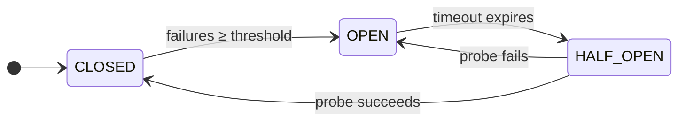

# Background & Theory

## Why Do We Need Circuit Breakers?

Modern software applications rarely run as a single isolated process. In today's distributed architectures — microservices, cloud-native APIs, enterprise systems — an application may depend on **dozens of external services**. Each dependency is a potential point of failure.

Consider this scenario:

> Your e-commerce platform has a **Payment Service**, an **Inventory Service**, a **Recommendation Engine**, and a **User Profile Service**. The Recommendation Engine goes down due to a memory leak. Every incoming request to your platform now waits for it to respond — timing out after 30 seconds. Within minutes, all available request threads are exhausted. Your **entire platform goes down** — not because of a payment failure, not because of inventory problems, but because of a **non-critical feature that could have been safely skipped**.

This phenomenon is called a **cascading failure**, and it is one of the most common root causes of major outages in distributed systems.

:::note[📸 Image Placeholder]
Insert a cascading failure diagram here — showing how a single failing service (e.g., Recommendation Engine) causes thread exhaustion that propagates and brings down the entire platform. A timeline or flow diagram works well.
:::

---

## What Problem Does the Circuit Breaker Solve?

The Circuit Breaker pattern, introduced by **Michael T. Nygard** in his book *Release It! (2007)*, solves exactly this problem.

A circuit breaker wraps calls to an external service and **monitors for failures**. When the failure rate exceeds a configurable threshold, the circuit breaker **trips open** — immediately rejecting all further requests to that service without even attempting a connection. This has two critical benefits:

1. **Fast failure** — Callers receive an immediate error response instead of waiting for a timeout. Thread resources are freed instantly.
2. **Recovery space** — The struggling service is no longer overwhelmed with incoming requests, giving it time to recover.

After a configurable timeout, the circuit breaker allows a single **probe request** through to test if the service has recovered. If the probe succeeds, traffic resumes. If it fails, the breaker stays open and the timeout resets.

---

## The Electrical Circuit Analogy

The pattern is named after the **electrical circuit breaker** found in every building's fuse box.

```
  NORMAL OPERATION          FAULT DETECTED           SAFE TO RETRY
  ──────────────────        ─────────────────        ─────────────────
  ╔═══╗  ╔══╗               ╔═══╗  ╔/ /╗              ╔═══╗  ╔──╗
  ║src╠══╣CB╠══[load]       ║src╠══╣CB ╠══[load]       ║src╠══╣CB╠══[load]
  ╚═══╝  ╚══╝               ╚═══╝  ╚═══╝               ╚═══╝  ╚══╝
  Current flows freely      Breaker trips open          Half-open probe
  CB = CLOSED               CB = OPEN                   CB = HALF_OPEN
```

When a fault is detected, the physical breaker flips open — stopping current flow and protecting the wiring. Once verified that the fault is resolved, the breaker is reset (closed) and power flows again.

Our software circuit breaker behaves identically — except instead of electrical current, it controls **HTTP request flow**, and instead of an electrician, an **automatic timeout** triggers the probe attempt.

:::note[📸 Image Placeholder]
Insert a side-by-side comparison image here — an electrical fuse box on the left versus the software circuit breaker state machine on the right, illustrating the analogy visually.
:::

---

## The Three States

A circuit breaker is a **finite state machine** with three states. Understanding these states — and the precise conditions that trigger transitions between them — is the core learning goal of this activity.



### 🟢 CLOSED — Normal Operation

All requests flow freely through to the backend server.

- Every request is forwarded.
- The circuit breaker **counts failures** (HTTP 5xx or connection exceptions).
- When `failureCount >= failureThreshold`, the breaker **transitions to OPEN**.

:::tip
The failure counter accumulates across multiple requests. A single successful request does **not** reset the counter — only a confirmed HALF_OPEN probe success resets it. This prevents a brief recovery from masking persistent instability.
:::

```json title="What you see in /lb/status"
{
  "circuitBreakerState": "CLOSED",
  "failureCount": 1,
  "failureThreshold": 3,
  "totalRequests": 10,
  "totalFailures": 1
}
```

### 🔴 OPEN — Fault Isolation

All requests are rejected **immediately** without contacting the backend.

- `canAttemptRequest()` returns `false` → the load balancer skips this server entirely.
- Clients receive **503 Service Unavailable** immediately (no network round-trip, no timeout).
- After `timeoutMs` milliseconds have elapsed, the breaker transitions to HALF_OPEN.

:::tip[OPEN state is a feature, not a bug]
By rejecting requests instantly, the circuit breaker frees thread pool resources, reduces load on an already-struggling backend, and provides fast failure to callers instead of 30-second timeouts.
:::

```json title="What you see in /lb/status"
{
  "circuitBreakerState": "OPEN",
  "failureCount": 3,
  "failureThreshold": 3,
  "remainingTimeoutMs": 7342,
  "totalRequests": 13,
  "totalFailures": 3
}
```

### 🟡 HALF_OPEN — Recovery Probe

A single test request is allowed through to check if the backend has recovered.

- `canAttemptRequest()` returns `true` for **exactly one** probe request.
- If the probe **succeeds** (2xx/3xx/4xx response): breaker → **CLOSED**, `failureCount` resets to 0.
- If the probe **fails** (5xx or exception): breaker → **OPEN** again, `openedAt` resets.

:::info
Only one probe is allowed through in HALF_OPEN. Allowing multiple concurrent probes would be dangerous — if the server is still fragile, a flood of probe requests could re-trigger the failure.
:::

```json title="What you see in /lb/status"
{
  "circuitBreakerState": "HALF_OPEN",
  "failureCount": 3,
  "failureThreshold": 3,
  "remainingTimeoutMs": 0,
  "totalRequests": 14,
  "totalFailures": 3
}
```

---

## Transition Summary

| From | Condition | To | Action |
|---|---|---|---|
| `CLOSED` | `failureCount >= threshold` | `OPEN` | Record `openedAt` timestamp |
| `OPEN` | `elapsedTime >= timeoutMs` | `HALF_OPEN` | Allow one probe request |
| `HALF_OPEN` | Probe succeeds (non-5xx) | `CLOSED` | Reset `failureCount` to 0 |
| `HALF_OPEN` | Probe fails (5xx) | `OPEN` | Reset `openedAt` timestamp |

---

## Thread Safety

In a real load balancer, many requests arrive **concurrently**. All circuit breaker state changes must be **thread-safe** to avoid race conditions. This implementation uses Java's atomic classes:

| Field | Type | Purpose |
|---|---|---|
| `state` | `AtomicReference<CircuitBreakerState>` | Safe state transitions using `compareAndSet` |
| `failureCount` | `AtomicInteger` | Lock-free failure counter |
| `openedAt` | `AtomicLong` | Timestamp of when the breaker opened |
| `totalRequests` | `AtomicInteger` | Statistics counter |
| `totalFailures` | `AtomicInteger` | Statistics counter |

:::info
`compareAndSet(expected, update)` is an **atomic test-and-set** operation. It only updates the value if it currently equals `expected`. This prevents two concurrent requests from both observing `failureCount >= threshold` and both trying to open the circuit — only the first one succeeds.
:::

---

## How Real Companies Use Circuit Breakers

### Netflix — Hystrix

Netflix was one of the pioneers of the circuit breaker pattern at scale. Their open-source library **Hystrix** was used to protect every inter-service call within their streaming platform. Netflix engineers reported that on a typical day, their platform deliberately induces thousands of fallbacks from open circuit breakers — without users noticing any degradation.

> *"If we don't have a way to stop the bleeding, one failing service can bring down the entire Netflix experience for 200 million subscribers."* — Netflix Technology Blog

Hystrix has since been deprecated in favour of **Resilience4j**, but the underlying circuit breaker principle remains identical.

### Amazon — Dependency Isolation

Amazon's retail website calls hundreds of microservices to render a single product page (recommendations, inventory, reviews, pricing, etc.). Each dependency is wrapped in a circuit breaker. If the **Review Service** is slow, the product page renders without reviews — rather than the entire page failing.

### Uber — Rate Limiting + Circuit Breaking

Uber combines circuit breakers with **rate limiting** to protect their dispatch service during peak demand. When a downstream GPS service degrades, circuit breakers activate and Uber falls back to cached location data — preserving ride matching functionality.

---

## Key Terminology

| Term | Definition |
|---|---|
| **Failure Threshold** | The number of consecutive failures required to trip the breaker OPEN |
| **Timeout** | How long (ms) the breaker stays OPEN before allowing a probe request |
| **Probe Request** | The single test request allowed through in HALF_OPEN state |
| **Cascading Failure** | A chain reaction where one failing component causes others to fail |
| **Fallback** | An alternative response returned when the circuit is OPEN |
| **Health Check** | A background poll of a service's `/actuator/health` endpoint |
| **Round-Robin** | A load balancing strategy that distributes requests evenly across servers |

---

Ready to build? Start with **[Part 1 → Build the Backend Server](part-1-backend-server/)**
