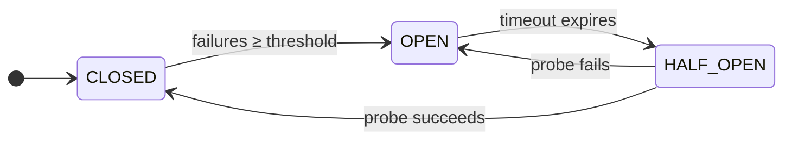

# Step 2: CircuitBreakerState

## Why This Enum Exists

Rather than tracking state with raw strings or integers (which are error-prone and unreadable), we use an **enum** — a type-safe set of named constants. The compiler prevents typos like `"CLOSD"` and enables exhaustive `switch` expressions.

## Where to Create It

All load balancer classes go directly in the `activitylb` base package — no sub-packages needed:

```
src/main/java/org/example/activitylb/
└── CircuitBreakerState.java   ← create this
```

## Code

```java
package org.example.activitylb;

/**
 * The three states of the Circuit Breaker pattern.
 *
 * State transitions:
 *
 *   CLOSED   → Normal operation. Requests pass through. Failures are counted.
 *   OPEN     → Circuit tripped. Requests rejected instantly (no backend contact).
 *               Waits for timeout, then transitions to HALF_OPEN.
 *   HALF_OPEN → Recovery probe. One request allowed through.
 *               Success → CLOSED. Failure → OPEN (timeout restarts).
 */
public enum CircuitBreakerState {
    CLOSED,
    OPEN,
    HALF_OPEN
}
```

## State Transition Diagram



:::info
The Javadoc comment in this enum is intentionally detailed. When students open `/lb/status` and see `"circuitBreakerState": "HALF_OPEN"`, they should immediately know what that means — and this enum is the canonical reference.
:::

---

:::tip
→ Continue to **[Step 3: Create CircuitBreaker](step-3-circuit-breaker)**
:::
