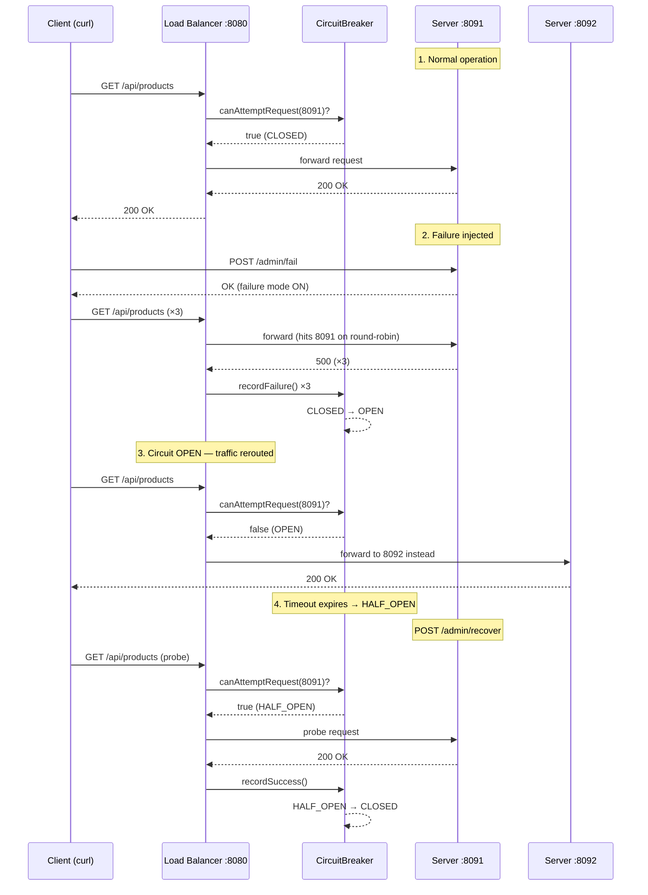

# Part 3 — Run & Demo

This is where the circuit breaker comes alive. You will start all four processes, inject a controlled failure, and watch the circuit breaker trip and automatically recover — all in real time.

## What You Will Observe



## Demo Checklist

| Step | File | What You Do |
|---|---|---|
| [Running All Services](running-all-services) | Steps 19–20 | Start 3 backend instances + load balancer. Verify basic routing. |
| [Triggering Failure](triggering-failure) | Test 2 | Crash one server, send requests, watch the breaker trip to OPEN |
| [Observing the Breaker](observing-circuit-breaker) | Dashboard | Read `/lb/status` and understand every field |
| [Recovery Demo](recovery-demo) | Test 3 | Recover the server, watch OPEN → HALF_OPEN → CLOSED |

## Terminal Layout

Keep **four terminal windows** open simultaneously throughout this part:

```
┌─────────────────────┐ ┌─────────────────────┐
│  Terminal 1         │ │  Terminal 2         │
│  activity-server    │ │  activity-server    │
│  port 8091          │ │  port 8092          │
└─────────────────────┘ └─────────────────────┘
┌─────────────────────┐ ┌─────────────────────┐
│  Terminal 3         │ │  Terminal 4         │
│  activity-server    │ │  activity-load-     │
│  port 8093          │ │  balancer :8080     │
└─────────────────────┘ └─────────────────────┘
```

:::info
Do not close any terminal between tests. All four processes must run simultaneously.
:::

---

Start here → **[Running All Services](running-all-services)**
