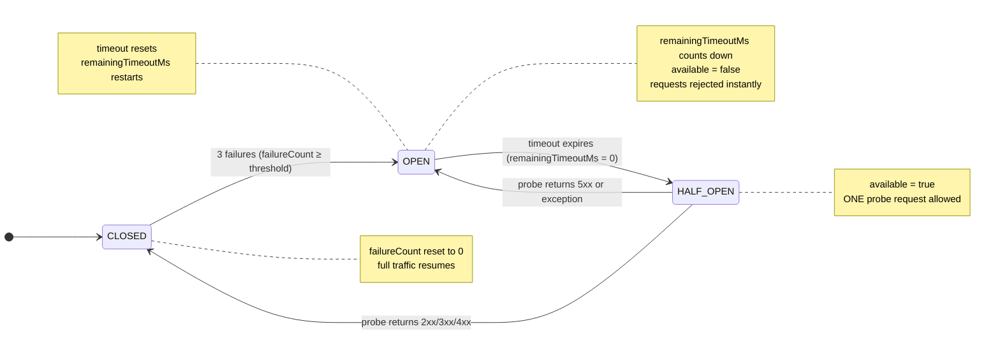

# Observing the Circuit Breaker

This page is your reference for reading and understanding the `/lb/status` dashboard while the circuit breaker is active.

---

## The Dashboard Endpoint

```bash
curl http://localhost:8080/lb/status
```

Keep this running in a loop while you work through Part 3:

```bash
# On Linux/macOS — poll every 2 seconds
while true; do curl -s http://localhost:8080/lb/status | python3 -m json.tool; sleep 2; done

# On Windows (PowerShell)
while ($true) { Invoke-RestMethod http://localhost:8080/lb/status | ConvertTo-Json -Depth 5; Start-Sleep 2 }
```

:::note[📸 Image Placeholder]
Insert a screenshot of a terminal running the polling loop above, showing the `remainingTimeoutMs` field counting down on the OPEN instance across successive outputs.
:::

---

## Field Reference

| Field | Type | Meaning |
|---|---|---|
| `availableInstances` | int | Number of backends currently accepting traffic |
| `totalInstances` | int | Total registered backends (from `lb.instances`) |
| `url` | string | Backend server URL |
| `healthy` | bool | Last `/actuator/health` poll was UP |
| `available` | bool | `healthy AND canAttemptRequest()` — the routing gate |
| `activeRequests` | int | In-flight requests currently being forwarded |
| `circuitBreakerState` | string | `CLOSED` / `OPEN` / `HALF_OPEN` |
| `failureCount` | int | Consecutive failures since last reset |
| `failureThreshold` | int | Threshold at which breaker trips OPEN |
| `totalRequests` | int | All-time requests through this instance |
| `totalFailures` | int | All-time failures recorded (does not reset) |
| `remainingTimeoutMs` | long | ms until OPEN transitions to HALF_OPEN; 0 otherwise |

---

## Three Snapshots to Observe

### Snapshot 1 — CLOSED (Normal)

```json
{
  "circuitBreakerState": "CLOSED",
  "failureCount": 0,
  "available": true,
  "remainingTimeoutMs": 0
}
```

All good. Requests flow freely.

### Snapshot 2 — OPEN (Failure Isolated)

```json
{
  "circuitBreakerState": "OPEN",
  "failureCount": 3,
  "available": false,
  "remainingTimeoutMs": 4512
}
```

Breaker tripped. Instance is excluded. `remainingTimeoutMs` is counting down.

### Snapshot 3 — HALF_OPEN (Probe Allowed)

```json
{
  "circuitBreakerState": "HALF_OPEN",
  "failureCount": 3,
  "available": true,
  "remainingTimeoutMs": 0
}
```

Timeout expired. One probe request is allowed through. The next request through this instance will either close the breaker (success) or re-open it (failure).

---

## The State Machine — Live



---

## What to Watch in the Terminal Logs

In **Terminal 4** (load balancer), you will see log lines like:

```
# Failure being counted
WARN  [CB] http://localhost:8091 failure 1/3
WARN  [CB] http://localhost:8091 failure 2/3
WARN  [CB] http://localhost:8091 failure 3/3
ERROR [CB] *** http://localhost:8091 → OPEN *** (3 consecutive failures hit threshold!)

# Timeout expiring
INFO  [CB] http://localhost:8091 → HALF_OPEN after 10043ms (probe request allowed)

# Probe succeeding
INFO  [CB] http://localhost:8091 → CLOSED (probe succeeded — server recovered!)

# HealthChecker detecting recovery
INFO  [HealthChecker] http://localhost:8091 is back UP → circuit breaker force-closed
```

:::note[📸 Image Placeholder]
Insert a screenshot of the load balancer terminal output showing the full sequence of log lines above — from `failure 1/3` through `→ OPEN` through `→ HALF_OPEN` through `→ CLOSED`. This is the clearest illustration of the entire state machine in action.
:::

---

## Important: `available` vs `healthy` vs `circuitBreakerState`

These three fields together tell you **why** an instance is or isn't getting traffic:

```
available = healthy  AND  circuitBreaker.canAttemptRequest()
               │                         │
               │                 CLOSED → true
               │                 OPEN (timeout not expired) → false
               │                 OPEN (timeout expired) → true (HALF_OPEN)
               │                 HALF_OPEN → true
               │
               └── Updated by HealthChecker every 5s
```

An instance can be `healthy: true` (actuator says UP) but `available: false` (circuit breaker is OPEN). Both must be true for the load balancer to route traffic to it.

---

→ **[Next: Recovery Demo](recovery-demo)**
